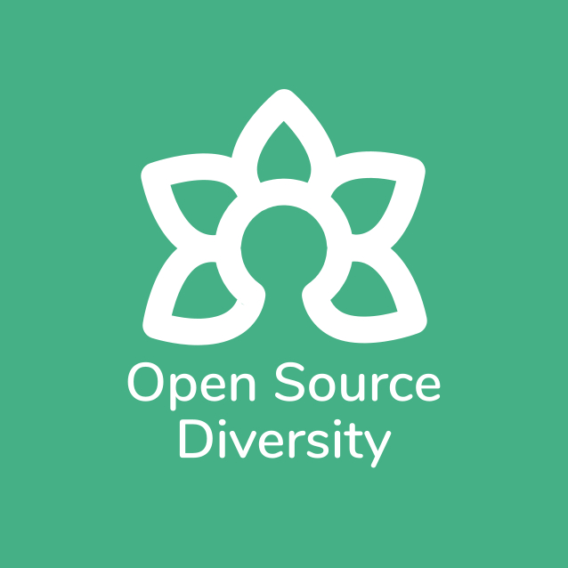
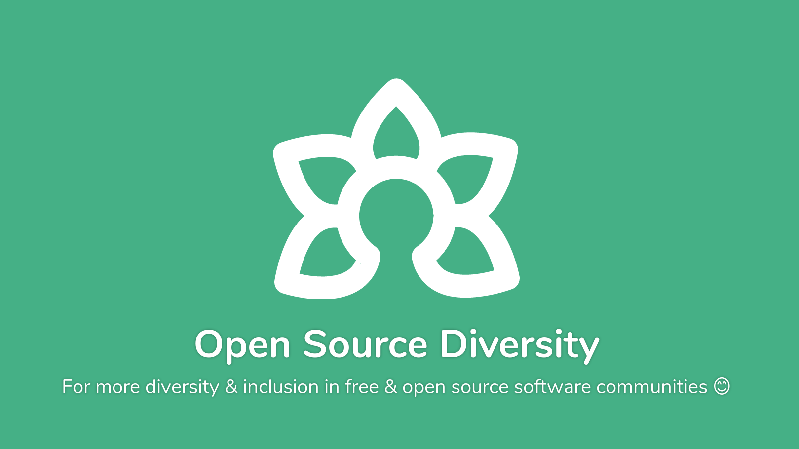
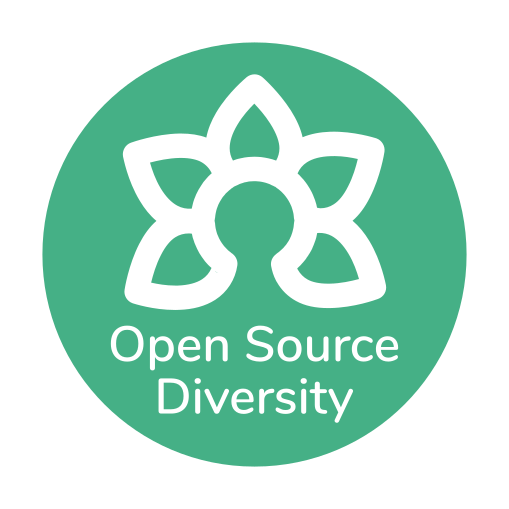
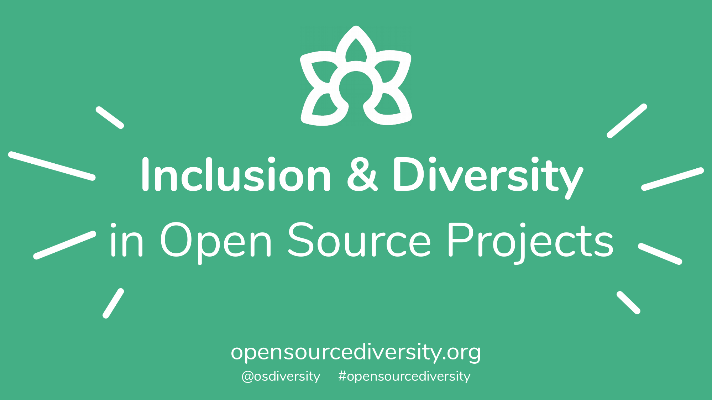

# [Open Source Diversity 🌼](https://opensourcediversity.org)

**For more diversity & inclusion in free & open source software communities 😊**

  

## 🐛 Issues or suggestions

If you found an issue on the page or only have a quick suggestion (for example a project to add), please open a new issue in [our issue list](https://github.com/opensourcediversity/opensourcediversity.org/issues). Thank you! 👍

## 👩‍💻 Contribute code or design

Contributing to this page is very easy!

1. **💻 Clone this repository** using [GitHub Desktop](https://desktop.github.com) (you can also use the command line)
2. **🌐 Simply open the `index.html`** in [your browser](https://www.mozilla.org/firefox/) (no web server required since it’s all client-side :)
3. **✏️ Make some changes** using your [text editor](https://atom.io) and test them in the browser
4. 🚀 Use GitHub Desktop to create a branch with your changes, push, and open a pull request

And that’s it! 🎉 Contributing to other open source projects is very similar, so you know the steps already!

As framework we use [🅱️ Bootstrap](https://getbootstrap.com) which you might already be familiar with. It’s very popular, so even if you don’t know it yet, learning about it will help you with lots of other projects too! 😊

## 📐 Project logos

- A good source for logos is their website or Twitter picture. SVG is preferred as the file size is usually smaller and it scales.
- The logos should have a maximum size of 300*300px.
- PNG and JPG logos are compressed with [Trimage](https://trimage.org) which is lossless. (We can also try [Image Shrinker](https://image-shrinker.com) but apparently this is lossy, so we shouldn’t use it for any source assets.)
- SVG images can be compressed using the also lossless scour using the command line: `scour -i filename.svg -o filename-compressed.svg --create-groups --enable-id-stripping --enable-comment-stripping --shorten-ids --remove-metadata --strip-xml-prolog --no-line-breaks;`

## 👩‍🚀 Contributors, backers & sponsors

This project exists thanks to all the **people who contribute**. 

Thank you to **all our backers**! 🙏 ([Become a backer](https://opencollective.com/opensourcediversity#backer))

**Support this project by becoming a sponsor.** Your logo will show up here with a link to your website. ([Become a sponsor](https://opencollective.com/opensourcediversity#sponsor))

## ♥ Code of Conduct

Please note that Open Source Diversity has a [Contributor Code of Conduct](https://github.com/opensourcediversity/opensourcediversity.org/blob/master/code-of-conduct.md) based on the [Contributor Covenant](https://www.contributor-covenant.org). By participating in this project online or at events you agree to abide by its terms.

## 📜 License

- **🔀 You can use & modify everything as long as you credit [Open Source Diversity](https://opensourcediversity.org) and use the same license for your resulting work.** [Code license is AGPLv3](https://www.gnu.org/licenses/agpl-3.0.en.html) and content is [Creative Commons Attribution-ShareAlike](https://creativecommons.org/licenses/by-sa/4.0/).
- 🎨 Logo by [Elio Qoshi](https://elioqoshi.me) of [Ura Design](https://ura.design) & [Open Source Design](https://opensourcedesign.net)
- 📄 [Nunito typeface](https://github.com/vernnobile/NunitoFont) by [Vernon Adams](http://sansoxygen.com)

## 🎉 Promotional material

Open Source Diversity promotional material like logos, banners, stickers and presentation slides is all in the [`promo` folder](https://github.com/opensourcediversity/opensourcediversity.org/tree/master/promo). Everyone is welcome to print material and present Open Source Diversity at events – permission is not needed, everyone in the community can help! 😊

If you do print banners or stickers, best try to get organizations to sponsor it. If that doesn’t work, you can use our [Open Collective](https://opencollective.com/opensourcediversity) to reimburse the costs. Ideally drop a short note in [our forum](https://discourse.opensourcediversity.org) about your plans of what to print and for which event as we have very limited funds. 🙂

### 🌼 Logo

The logo is `#fff` white on `#45b086` green/turquoise. If you need the logo on white, use the inverse. There are more logo versions in the [`img` folder](https://github.com/opensourcediversity/opensourcediversity.org/tree/master/img).

As typeface we use [Nunito](https://github.com/opensourcediversity/opensourcediversity.org/tree/master/css) in Regular and Bold, without other weights nor italic styles.

### 🖼 Banner

If you write a Tweet, Mastodon toot or other kind of post and need a bigger banner, use this:

### ⭕ Stickers

We usually order [Flyeralarm outdoor stickers](https://www.flyeralarm.com/de/shop/configurator/index/quantity/7983970#159=601&160=602&161=615&162=585), 4.5 cm round. If you want to order some, use the file [`sticker-45mm.jpg`](https://raw.githubusercontent.com/opensourcediversity/opensourcediversity.org/master/promo/sticker-45mm.jpg) for printing.

### 📺 Presentation

We have the [`Open Source Diversity presentation.pdf`](https://github.com/opensourcediversity/opensourcediversity.org/blob/master/promo/Open%20Source%20Diversity%20presentation.pdf) which is roughly 20 minutes long, and [`Open Source Diversity presentation lightning.pdf`](https://github.com/opensourcediversity/opensourcediversity.org/blob/master/promo/Open%20Source%20Diversity%20presentation%20lightning.pdf) for 5-minute lightning talks.

Anyone is encouraged to give the presentation at a conference! 😊 If you do so, feel free to use these texts for submitting the talk:

> **Diversity and Inclusion in Free & Open Source Software**
>
> Diversity & inclusion is very important especially for free & open source community, because people in tech nowadays are hired to a big part because of their open source contributions. To improve the balance there, the free & open source software community is an important starting point.
>
> We are building https://opensourcediversity.org to collect the projects and resources in this field. It is aimed at maintainers and contributors of open source projects who want to improve, as well as people from underrepresented groups who are interested in free & open source software but don’t know where to start.

Longer description:

> Diversity & inclusion is very important especially for free & open source community, because:
>
> - People in tech nowadays are hired to a big part because of their open source contributions. To improve the balance there, the free & open source software community is an important starting point.
> - More diverse teams make for more innovation and serving users better than homogenous teams.
> - Diverse open source projects are more welcoming and friendly towards new contributors, encouraging learning and collaboration.
>
> We are building https://opensourcediversity.org to collect the projects and resources in this field. It is aimed at maintainers and contributors of open source projects who want to improve, as well as people from underrepresented groups who are interested in free & open source software but don’t know where to start.
>
> This talk is a showcase of the different initiatives for diversity & inclusion existing in open source, and a start for discussion where we can improve more.
